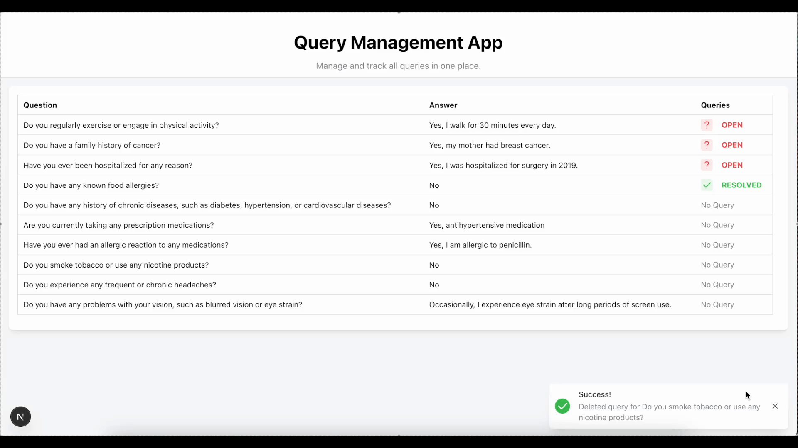

# Query Management App

A full-stack application that allows users to view and manage queries related to form submissions, modeled after real-world clinical trial workflows.

### ✅ Features Implemented
- Scrollable table view for all form submissions
- Create, view, and delete queries via modal interface
- Dynamic status tracking with color-coded labels and automatic row sorting
- RESTful API built with Fastify, Prisma ORM, and PostgreSQL
- Integrated Swagger documentation for API reference
- CORS support enabling secure cross-origin requests
- Deployed frontend on Vercel and backend on Render

---

## 🚀 Live Demo

- [**Frontend**](https://vial-assignemnt-frontend.vercel.app)
- [**Backend API**](https://vial-assignment-backend.onrender.com)
- [**API Docs (Swagger)**](https://vial-assignment-backend.onrender.com/docs)

> Please note that the backend deployment may expire due to free hosting limitations. GIFs below demonstrate the core features of the app.

_Create Query_

_Resolve Query_

_Delete Query_


---

## 📦 Project Structure
```plaintext
query-management-app/
├── frontend/         # Next.js frontend
├── prisma/           # Prisma schema and migration files
├── src/              # Fastify backend source code
├── package.json      # Backend dependencies and scripts
├── .env.example      # Example environment variables
├── README.md         # This file
└── other files...   
```

## 🛠️ Running Locally

### ⚙️ Backend Setup

1. Clone the repo:
    ```bash
    git clone https://github.com/mengweij/query-management-app.git
    cd query-management-app
    ```
2. Copy the `.env.example` file into a `.env` file
3. Start the backend api with Docker:
    ```bash
    docker-compose build
    docker-compose up
    ```
4. Generate Prisma client and apply schema:
    ```bash
    npm run migrate
    ```
5. Seed the database:
    ```bash
    npm run seed:dev
    ```

Backend will run on http://localhost:8080. Swagger API docs: http://localhost:8080/docs.

---

### 🧑‍🎨 Frontend Setup
1. Navigate to the frontend folder:
    ```bash
    cd frontend
    ```
2. Install dependencies:
    ```bash
    npm install
    ```
3. Create a `.env.local` file in the `frontend` directory and add the following:
    ```plaintext
    NEXT_PUBLIC_API_URL=http://localhost:8080
    ```
4. Run dev server:
    ```bash
    npm run dev
    ```

Frontend will run on http://localhost:3000.


